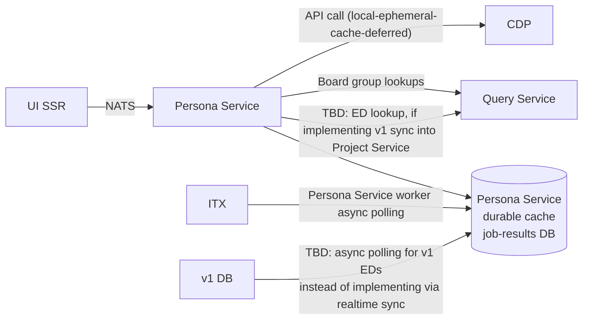

# LFX UI Persona Service

## Overview

The Persona Service is a decoupled microservice component of the LFX UI layer.
It provides a personalized, fast summary of a user's involvement and status
across Linux Foundation projects and foundations, for the purpose of UI/UX
feature enablement and navigation.

### What this is not

This is **not** a v2 entity/resource API service. It does not define or enforce
access control. The name "Persona" is chosen deliberately over "Role" to avoid
any ambiguity with authorization concepts: personas are about *presenting*
relevant context to the user, not *gating* access.

### What this is

A fast, user-centric aggregation layer. It accelerates, pre-loads, or provides
privileged proxy access to data about a user's involvement or status across
multiple backend systems, organized into a format optimized for UI consumption.

Because this service's primary purpose is to reduce UI churn and latency rather
than expose a stable business API, it is structured as a **NATS RPC endpoint**
rather than a REST API following v2 idioms. Ownership sits with the UI team;
this is not intended to become a "core service" (contrast: User Service `/me`).

## Personas

Personas are **not a singleton** per user. A user may have more than one
persona, and personas may fan out across multiple foundations and/or projects
beneath them.

The personas described below are navigation-centric: they represent a user's
most relevant entry points into the LFX platform.

### Board Member

Determined by membership in a Board group (committee).

**Open questions / action items:**

1. Investigate committee-type tag propagation to indexed `committee-member`
   records.
2. Return a membership stub and pass the buck to the UI to determine gating by
   role — the Persona Service itself should not make access-control decisions.

**TBD:** A query-service capability to answer "does username X have relationship
Y to object Z?" with support for filtering by committee (without exposing the
`committee-member` pseudotype directly).

### Executive Director (ED)

Determined by the ED field on the project object.

**TBD:** Add ED as a denormalized username/name/email field to the v2 project
model (same pattern as writers/auditors), and decide between:

- Bidirectional sync with v1, or
- Same model as ITX.

### Maintainer

Determined by CDP data.

**TBD:** Evaluate reuse of the same API used for the affiliations screens.
Consider introducing a caching layer in front of the CDP call.

### Contributor

The "default view." Also filtered by projects the user actually has some
involvement in. It is intentionally out of scope for this service to define
whether contributor status is a hard gate or a "promoted / recommended"
navigation hint — this service is not access control.

Sources that may indicate contributor status:

- CDP (maintainer, contributor, or any activity)
- Access control membership (writer/auditor)
- Committee membership
- ITX activity (meetings, mailing lists)

## Data flow

## Open questions

- **`/me` service:** David raised the question of whether a consolidated `/me`
  service is needed to report current roles. The current framing treats this
  more as a UI component: aggregating data from multiple systems, organizing it
  for UI consumption, and ensuring performance is a "UI churn" activity, not a
  "business API." A NATS RPC endpoint (rather than a REST API) reflects this
  distinction.

- **ED sync strategy:** Decide between implementing a bidirectional v1↔v2 sync
  for ED data versus polling v1 DB asynchronously via the job-results DB
  pattern.

- **Contributor gating:** Clarify whether "contributor" is a hard gate or a
  softer "promoted navigation" hint. This is likely outside the scope of this
  service.

- **Query Service committee filtering:** Define what surface area Query Service
  needs to expose to support "does user X have relationship Y to object Z?"
  without leaking the `committee-member` pseudotype.
