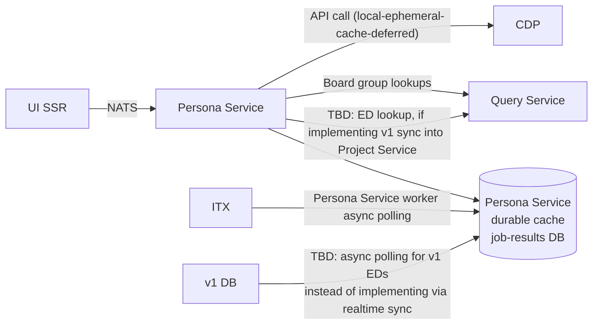

# LFX UI Persona Service

## Overview

The Persona Service is a decoupled microservice component of the LFX UI layer.
It provides a personalized, fast summary of a user's involvement and status
across Linux Foundation projects and foundations, for the purpose of UI/UX
feature enablement and navigation.

### What this is not

This is **not** a v2 entity/resource API service. It does not define or enforce
access control. The name "Persona" is chosen deliberately over "Role" to avoid
any ambiguity with authorization concepts: personas are about *presenting*
relevant context to the user, not *gating* access.

### What this is

A fast, user-centric aggregation layer. It accelerates, pre-loads, or provides
privileged proxy access to data about a user's involvement or status across
multiple backend systems, organized into a format optimized for UI consumption.

Because this service's primary purpose is to reduce UI churn and latency rather
than expose a stable business API, it is structured as a **NATS RPC endpoint**
rather than a REST API following v2 idioms. Ownership sits with the UI team;
this is not intended to become a "core service" (contrast: User Service `/me`).

## Personas

Personas are **not a singleton** per user. A user may have more than one
persona, and personas may fan out across multiple foundations and/or projects
beneath them.

The personas described below are navigation-centric: they represent a user's
most relevant entry points into the LFX platform.

### Board Member

Determined by membership in a committee whose `category` is `"Board"` (the
exact enum value used by the Committee Service and propagated to indexed
documents).

#### Detection strategy

The `committee_member` OpenSearch document carries a
`committee_category:<value>` tag (e.g. `committee_category:Board`) inherited
from its parent committee at index time. This tag is confirmed present in the
indexed schema; no additional propagation work is needed.

Identity matching presents a complication: the `data.username` field on
`committee_member` records is not reliably populated (it may be an empty
string), while `data.email` is generally present. To maximise recall, the
Persona Service issues **two queries in parallel** against the query service
and merges the results by `committee_member_uid`:

1. **Email match** — filter `object_type:committee_member` +
   `committee_category:Board` + `email:<user-email>` (tag term lookup).
2. **Username match** — filter `object_type:committee_member` +
   `committee_category:Board` + `data.username:<username>` (structured field
   filter, skipped if the caller's username is empty).

Results from both legs are de-duplicated by `id` (the `committee_member` UUID
exposed as `Resource.id` in the Query Service response) before returning to
the caller.

#### Local post-filter for username results

Because the Query Service `filters` parameter issues a term clause against
`data.username` (prefixed internally as `data.username:<value>`), the match
may be overly liberal depending on analyzer behavior. After receiving results
from the username leg, the Persona Service **must perform an exact local
filter**, discarding any records where `data.username` does not exactly equal
the requested username (case-insensitive). The email leg does not require this
treatment because the `email:<value>` tag lookup is an exact term match
against a structured tag value.

#### What is returned

The Query Service returns `Resource` objects with shape `{ type, id, data }`,
where `data` is the raw committee member snapshot. For each de-duplicated
result the Persona Service extracts and returns a stub containing:

- `data.committee_uid` and `data.committee_name` — for UI navigation.
- `data.project_uid` and `data.project_slug` (from the committee's tags,
  denormalised onto the member at index time) — for project-scoped routing.
- `id` (the committee member UUID) — for deep-linking.
- `data.role.name` and `data.voting.status` — the "group role" within the
  board (e.g. Chair, Observer, Voting Rep, None); the UI decides how to
  present or gate based on these values. The full set of valid role and voting
  status values is defined by the Committee Service enum and carried
  as-is; the Persona Service does not filter or interpret them.

The Persona Service does **not** make access-control decisions based on role
or voting status; it surfaces the data and defers gating entirely to the UI.

#### Query Service API calls

Both legs call `GET /query/resources?v=1` on the Query Service. The existing
API surface is sufficient — no new endpoints or schema changes are required.

**Email leg:**

```
type=committee_member
tags_all=committee_category:Board, email:<user-email>
```

**Username leg** (skipped when username is empty):

```
type=committee_member
tags_all=committee_category:Board
filters=username:<username>
```

The `tags_all` parameter performs an AND match across all supplied tag values,
ensuring only Board-category members are returned. The `filters` parameter
issues a term clause on `data.username`. Results are then locally post-filtered
for exact username equality before merging with the email leg results.

### Executive Director (ED)

Determined by a denormalized ED field on the v2 project object, carrying the
ED's username, display name, and email — the same pattern used for `writers`
and `auditors` on the project model.

#### Prerequisites (not yet implemented)

The ED field does not currently exist on the v2 project model. Before the
Persona Service can serve this persona, two pieces of work are required:

1. **v2 Project Service** — add an `executive_director` field (or equivalent)
   to the project create/update API and the indexed project document, storing
   at minimum `username`, `first_name`, `last_name`, and `email`.

2. **v1 Sync Helper** — add ED sync as a new mapping in
   `handlers_projects.go`. The v1 project record holds the ED as a Salesforce
   contact SFID in the `executive_director__c` field. The
   sync helper must dereference that SFID to a `V1User` via `lookupV1User`
   (the same pattern already used for committee members in
   `handlers_committees.go`), then write `username`, `first_name`,
   `last_name`, and `email` into the v2 project payload. The `username` field
   must be passed through `mapUsernameToAuthSub` before being stored, as is
   done for all user references in the sync helper.

3. **Re-index all v2 projects** — once the Project Service field and sync
   helper mapping are in place, a full re-index of all project documents is
   required so that existing projects carry the `executive_director` field in
   OpenSearch and are queryable by the Persona Service.

#### Detection strategy

Once the field is present on the indexed project document, the Persona Service
queries the Query Service for all projects where
`data.executive_director.username` matches the requesting user's username:

```
type=project
filters=executive_director.username:<username>
```

A local post-filter against exact username equality must be applied to the
results for the same reason as the Board Member username leg — the `filters`
term clause may be overly liberal.

#### What is returned

For each matching project the Persona Service returns a stub containing:

- `data.uid` and `data.slug` — for project-scoped routing.
- `data.name` — for display.

#### Alternate approach

As an alternative to the v1 Sync Helper pattern, the ED could be populated by
polling the v1 Project Service API directly and writing results into the
job-results DB. No implementation guidance is provided for this path.

### Contributor

The "default view." The Contributor persona represents any project engagement
the user has, drawn from four sources unioned together. It is intentionally
out of scope for this service to define whether contributor status is a hard
gate or a softer navigation hint — this service is not access control.

#### Output shape

All four sources converge on the same output unit: a list of
`{ project_uid, project_slug }` tuples (with optional extra context per
source). The Persona Service unions these lists, de-duplicates by
`project_uid`, and returns the merged set.

#### CDP lookup flow (shared by sources 1 and 2)

The Persona Service reuses the same two-step flow already implemented in the
LFX SSR app (`cdp.service.ts`), ported to Go:

1. **Resolve** — `POST /api/v1/members/resolve` with `{ lfids: [username],
   emails: [email] }` to obtain the CDP `memberId`. A 404 means CDP has no
   profile for this user; sources 1 and 2 yield empty lists (sources 3 and
   4 are unaffected).

2. **Fetch affiliations** — `GET /api/v1/members/{memberId}/project-affiliations`
   to obtain the full list of project affiliations with roles and activity.

**Authentication**: Auth0 client credentials with a CDP-specific audience:

- **Token endpoint**: `${AUTH0_ISSUER_BASE_URL}/oauth/token`
- **Credentials**: Auth0 client credentials for the **"LFX One"** application
  (`AUTH0_CLIENT_ID` / `AUTH0_CLIENT_SECRET`), which already holds the
  `read:project-affiliations` and `read:maintainer-roles` grants against the
  CDP audience (see `grants_cdp.tf`). For initial implementation, sharing
  these credentials with the SSR app is acceptable; a dedicated Persona
  Service M2M client can be split out later.
- **Audience**: `CDP_AUDIENCE`
- **Token cache**: in-process, with a 5-minute buffer before expiry.

**Caching**: The resolved `memberId` and the full affiliations response should
be cached in-process with a simple TTL (suggested: 5 minutes). A more durable
cache (e.g. NATS KV) can be introduced later if CDP latency becomes a
bottleneck.

#### Source 1: CDP activity (Snowflake)

In parallel with the CDP affiliations call, use the CDP `memberId` from the
resolve step to query Snowflake for a list of projects the user has any
recorded activity in. This uses fast/approximate aggregation functions only —
no per-contribution detail.

**Snowflake auth**: RSA private key JWT, identical to the SSR app pattern:

- **Credentials**: `SNOWFLAKE_ACCOUNT`, `SNOWFLAKE_USER`, `SNOWFLAKE_ROLE`,
  `SNOWFLAKE_DATABASE`, `SNOWFLAKE_WAREHOUSE`, `SNOWFLAKE_API_KEY` (PEM
  private key).
- For initial implementation, credential reuse from the UI is acceptable;
  can be split out later.

The specific Snowflake query (table/column names, schema) must be validated
during development against the CDP Snowflake schema.

#### Source 2: CDP roles and affiliations

From the `/project-affiliations` response, collect all entries. Each entry
contributes a `{ projectSlug, projectName, projectLogo }` tuple to the
Contributor project list. Entries where `roles[]` is non-empty additionally
carry the role detail (`roles[].role`) as supplementary context for the UI
— the UI may choose to surface these as a "Maintainer" label or similar, but
the Persona Service does not treat them as a distinct persona type.

#### Source 3: Access control membership (writers and auditors)

Any project for which the user holds a `writer` or `auditor` relationship
is identified via a Query Service term filter against `data.writers` and
`data.auditors`, which are present on the indexed project document today:

```
type=project
filters=writers:<username>
```

and in parallel:

```
type=project
filters=auditors:<username>
```

Results from both legs are de-duplicated by `Resource.id` before merging.
A local exact post-filter must be applied for the same reason as other
`filters`-based lookups — the term clause may be overly liberal.

#### Source 3 future extension: Project contacts index

The longer-term approach is to query via the `contacts` nested field on
the indexed project document, which would also cover ED and PMO contacts.
`contacts` is a first-class `nested` field in the OpenSearch mapping
(separate from `data`) and carries `lfx_principal`, `name`, `emails`, and
`profile` per entry. This depends on two non-trivial pieces of work:

1. **Project Service** — needs to be updated to populate the `contacts`
   array in its indexer messages (writers, auditors, ED, PMO). ED and PMO
   fields only become available after the v1 Sync Helper work lands them
   on the project model (see Executive Director section).

2. **New Query Service endpoint** — the existing resource search API
   cannot query `nested` fields; a dedicated contacts search endpoint is
   required. This is a net-new capability, not a parameter addition.

#### Source 4: Committee membership

Any project reachable via the user's committee memberships (Board or
otherwise) implies contributor status. This data is already obtained as
a by-product of the Board Member persona query; the `project_uid` and
`project_slug` values from those results can be folded in directly without
an additional call.

#### CDP flow dependency

Sources 1 and 2 both depend on the CDP resolve step. If CDP returns 404
(no profile), both sources yield empty lists; sources 3 and 4 are
unaffected.

## Data flow



## Open questions

- **`/me` service:** David raised the question of whether a consolidated `/me`
  service is needed to report current roles. The current framing treats this
  more as a UI component: aggregating data from multiple systems, organizing it
  for UI consumption, and ensuring performance is a "UI churn" activity, not a
  "business API." A NATS RPC endpoint (rather than a REST API) reflects this
  distinction.

- **ED sync strategy:** Decide between implementing a bidirectional v1↔v2 sync
  for ED data versus polling v1 DB asynchronously via the job-results DB
  pattern.

- **Contributor gating:** Clarify whether "contributor" is a hard gate or a
  softer "promoted navigation" hint. This is likely outside the scope of this
  service.

- **Query Service committee filtering:** Define what surface area Query Service
  needs to expose to support "does user X have relationship Y to object Z?"
  without leaking the `committee-member` pseudotype.
