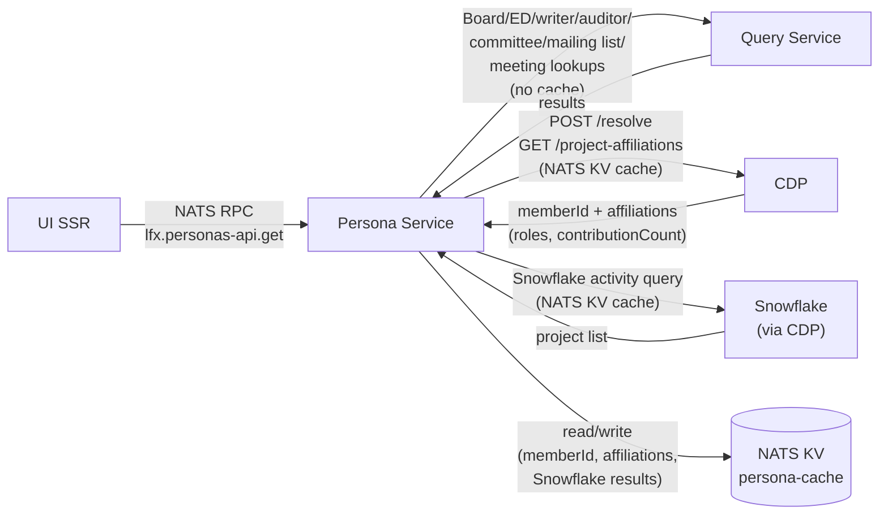

# LFX UI Persona Service

## Overview

The Persona Service is a decoupled microservice component of the LFX UI layer.
It provides a personalized, fast summary of a user's involvement and status
across Linux Foundation projects and foundations, for the purpose of UI/UX
feature enablement and navigation.

### What this is not

This is **not** a v2 entity/resource API service. It does not define or enforce
access control. The name "Persona" is chosen deliberately over "Role" to avoid
any ambiguity with authorization concepts: personas are about *presenting*
relevant context to the user, not *gating* access.

### What this is

A fast, user-centric aggregation layer. It accelerates, pre-loads, or provides
privileged proxy access to data about a user's involvement or status across
multiple backend systems, organized into a format optimized for UI consumption.

Because this service's primary purpose is to reduce UI churn and latency rather
than expose a stable business API, it is structured as a **NATS RPC endpoint**
rather than a REST API following v2 idioms. Ownership sits with the UI team;
this is not intended to become a "core service" (contrast: User Service `/me`).

## Request / Response

> **Design intent:** The contract below is intentionally agnostic and
> flexible. It is designed to meet current known requirements while
> leaving room for requirements to be refined without forcing premature
> API churn. The trade-off is that the UI must do a small amount of
> "promote out" work for nested data — for example, inspecting
> `cdp_roles.extra.roles[]` to decide whether to surface a "Maintainer"
> label, rather than receiving a pre-computed flag. As UI requirements
> solidify, the contract can be revised to be more closely aligned to
> UI consumption patterns.
>
> **The only expected consumer of this endpoint is the LFX UI.** This
> is not a public or cross-team API. Changes to the contract should be
> coordinated between the Persona Service and the UI; no other services
> should depend on it.

### NATS subject

```
lfx.personas-api.get
```

Queue group: `lfx.personas-api.queue`

The caller issues a NATS request/reply on this subject and awaits a single reply on the auto-generated inbox. The service subscribes with a queue group so that multiple instances load-balance automatically.

**Timeout / deadline budget:** The recommended caller timeout is **5 seconds**. Internally, the service fans out all upstream calls concurrently and enforces a shared context deadline so that slow or unresponsive upstream systems do not block the reply beyond this budget. If the overall deadline is exceeded before all sources respond, partial results from sources that have already returned are used and the remainder are treated as empty (see `error` handling below).

### Request

```json
{
  "username": "jdoe",
  "email": "jdoe@example.com"
}
```

| Field | Type | Required | Notes |
|-------|------|----------|-------|
| `username` | string | yes | Auth0 `nickname` / LFX username. May be empty string if not yet set on the account; sources that rely on username matching are skipped when empty. |
| `email` | string | yes | Primary email address for the requesting user. Used as the primary identity signal for all email-leg queries. |

### Response

```json
{
  "projects": [
    {
      "project_uid": "...",
      "project_slug": "my-project",
      "detections": [
        {
          "source": "board_member",
          "extra": {
            "committee_uid": "...",
            "committee_name": "TAC",
            "committee_member_uid": "...",
            "role": "Chair",
            "voting_status": "Voting Rep"
          }
        },
        {
          "source": "cdp_roles",
          "extra": {
            "contributionCount": 42,
            "roles": [
              {
                "id": "...",
                "role": "Maintainer",
                "startDate": "2024-01-01T00:00:00Z",
                "endDate": null,
                "repoUrl": "https://github.com/org/repo",
                "repoFileUrl": "..."
              }
            ]
          }
        },
        { "source": "mailing_list" }
      ]
    }
  ],
  "error": null
}
```

`projects` is always present, and is empty (`[]`) when no matches are found across any source.

#### `projects[]`

One entry per unique `project_uid`. A project that matches via multiple sources is represented once, with one detection object per matching source.

| Field | Type | Notes |
|-------|------|-------|
| `project_uid` | string | UUID of the project. |
| `project_slug` | string | Slug — for UI routing. |
| `detections` | object[] | One entry per source that matched. Never empty. |

#### `detections[]`

| Field | Type | Notes |
|-------|------|-------|
| `source` | string | Token identifying the detection source (see table below). |
| `extra` | object | Optional. Source-specific context. Omitted when the source has no supplementary data to provide. |

**`source` token values:**

| Token | Source | `extra` fields (when present) |
|-------|--------|-------------------------------|
| `board_member` | Board Member — committee query | `committee_uid`, `committee_name`, `committee_member_uid`, `role`, `voting_status` |
| `executive_director` | Executive Director — project query | _(none)_ |
| `cdp_activity` | Source 1 — Snowflake activity | _(none)_ |
| `cdp_roles` | Source 2 — CDP affiliations | `contributionCount` (number), `roles[]` (passed through as-is from CDP; see shape below) |
| `writer_auditor` | Source 3 — access control | _(none)_ |
| `committee_member` | Source 4 — non-Board committee membership | `committee_uid`, `committee_name`, `committee_member_uid`, `role` |
| `mailing_list` | Source 5 — mailing list subscriptions | _(none)_ |
| `meeting_attendance` | Source 6 — meeting attendance | _(none)_ |

**`cdp_roles` extra shape:**

```typescript
{
  contributionCount: number;   // from CDP /project-affiliations (Source 2)
  roles: {
    id: string;
    role: string;
    startDate: string;         // ISO 8601 timestamp
    endDate: string | null;
    repoUrl: string;
    repoFileUrl: string;
  }[];
}
```

The UI is responsible for interpreting `roles[]` (e.g. surfacing a "Maintainer" label). The Persona Service passes role data through without filtering or interpretation.

`cdp_roles` is only emitted when the CDP `/project-affiliations` response includes an entry for this project. Both `contributionCount` and `roles[]` come directly from that response.

**Note:** `cdp_activity` (Source 1) is retained as a separate token for projects where Snowflake records activity but CDP has no affiliation entry. During implementation, if `contributionCount` on `cdp_roles` proves sufficient to cover the Source 1 signal, `cdp_activity` may be dropped.

A single project entry may carry multiple detections with the same `source` token if the user matched via that source more than once (e.g. membership in two Board-category committees under the same project produces two `board_member` detection objects with different `extra` values).

#### `error`

`null` on success. On a hard failure (e.g. upstream NATS timeout, unrecoverable internal error) the response carries a non-null error object and `projects` is empty:

```json
{
  "projects": [],
  "error": {
    "code": "upstream_timeout",
    "message": "query service did not respond within deadline"
  }
}
```

Partial failures (e.g. CDP returning 404, one Query Service leg timing out) are treated as empty results for the affected source — they do not surface as top-level errors. The service returns whatever it was able to collect.

## Personas

Personas are **not a singleton** per user. A user may have more than one
persona, and personas may fan out across multiple foundations and/or projects
beneath them.

The personas described below are navigation-centric: they represent a user's
most relevant entry points into the LFX platform.

### Board Member

Determined by membership in a committee whose `category` is `"Board"` (the
exact enum value used by the Committee Service and propagated to indexed
documents).

#### Detection strategy

The `committee_member` OpenSearch document carries a
`committee_category:<value>` tag (e.g. `committee_category:Board`) inherited
from its parent committee at index time. This tag is confirmed present in the
indexed schema; no additional propagation work is needed.

Identity matching presents a complication: the `data.username` field on
`committee_member` records is not reliably populated (it may be an empty
string), while `data.email` is generally present. To maximise recall, the
Persona Service issues **two queries in parallel** against the query service
and merges the results by `committee_member_uid`:

1. **Email match** — filter `object_type:committee_member` +
   `committee_category:Board` + `email:<user-email>` (tag term lookup).
2. **Username match** — filter `object_type:committee_member` +
   `committee_category:Board` + `data.username:<username>` (structured field
   filter, skipped if the caller's username is empty).

Results from both legs are de-duplicated by `id` (the `committee_member` UUID
exposed as `Resource.id` in the Query Service response) before returning to
the caller.

#### Local post-filter for username results

Because the Query Service `filters` parameter issues a term clause against
`data.username` (prefixed internally as `data.username:<value>`), the match
may be overly liberal depending on analyzer behavior. After receiving results
from the username leg, the Persona Service **must perform an exact local
filter**, discarding any records where `data.username` does not exactly equal
the requested username (case-insensitive). The email leg does not require this
treatment because the `email:<value>` tag lookup is an exact term match
against a structured tag value.

#### What is returned

For each de-duplicated result, the Persona Service adds a `board_member`
detection to the matching `projects[]` entry, with committee-level fields
(`committee_uid`, `committee_name`, `committee_member_uid`, `role`,
`voting_status`) carried in the detection's `extra` map. See the
Request/Response section for the full field definitions.

The Persona Service does **not** make access-control decisions based on role
or voting status; it surfaces the data and defers gating entirely to the UI.

#### Query Service API calls

Both legs call `GET /query/resources?v=1` on the Query Service. The existing
API surface is sufficient — no new endpoints or schema changes are required.

**Email leg:**

```
type=committee_member
tags_all=committee_category:Board, email:<user-email>
```

**Username leg** (skipped when username is empty):

```
type=committee_member
tags_all=committee_category:Board
filters=username:<username>
```

The `tags_all` parameter performs an AND match across all supplied tag values,
ensuring only Board-category members are returned. The `filters` parameter
issues a term clause on `data.username`. Results are then locally post-filtered
for exact username equality before merging with the email leg results.

### Executive Director (ED)

Determined by a denormalized ED field on the v2 project object, carrying the
ED's username, display name, and email — the same pattern used for `writers`
and `auditors` on the project model.

#### Prerequisites (completed)

The ED field is now present on the v2 project model. The following work was
required to enable this persona:

1. **v2 Project Service** — add an `executive_director` field (or equivalent)
   to the project create/update API and the indexed project document, storing
   at minimum `username`, `first_name`, `last_name`, and `email`.

2. **v1 Sync Helper** — add ED sync as a new mapping in
   `handlers_projects.go`. The v1 project record holds the ED as a Salesforce
   contact SFID in the `executive_director__c` field. The
   sync helper must dereference that SFID to a `V1User` via `lookupV1User`
   (the same pattern already used for committee members in
   `handlers_committees.go`), then write `username`, `first_name`,
   `last_name`, and `email` into the v2 project payload. The `username` field
   must be passed through `mapUsernameToAuthSub` before being stored, as is
   done for all user references in the sync helper.

3. **Re-index all v2 projects** — once the Project Service field and sync
   helper mapping are in place, a full re-index of all project documents is
   required so that existing projects carry the `executive_director` field in
   OpenSearch and are queryable by the Persona Service.

#### Detection strategy

Once the field is present on the indexed project document, the Persona Service
queries the Query Service for all projects where
`data.executive_director.username` matches the requesting user's username:

```
type=project
filters=executive_director.username:<username>
```

A local post-filter against exact username equality must be applied to the
results for the same reason as the Board Member username leg — the `filters`
term clause may be overly liberal.

#### What is returned

For each matching project the Persona Service adds an `executive_director`
detection to the matching `projects[]` entry. No `extra` fields are attached.
See the Request/Response section for the response shape.

#### Alternate approach

As an alternative to the v1 Sync Helper pattern, the ED could be populated by
polling the v1 Project Service API directly and writing results into the
job-results DB. No implementation guidance is provided for this path.

### Community

The "default view." The Community persona represents any project engagement
the user has, drawn from six sources unioned together. It is intentionally
out of scope for this service to define whether community membership is a hard
gate or a softer navigation hint — this service is not access control.

#### Output shape

All six sources converge on the same output unit. The Persona Service unions
results across all sources, de-duplicates by `project_uid`, and returns each
project once with a `detections[]` array listing every source token that
matched it (see the Request/Response section for the full token table).

#### CDP lookup flow (shared by sources 1 and 2)

The Persona Service reuses the same two-step flow already implemented in the
LFX SSR app (`cdp.service.ts`), ported to Go:

1. **Resolve** — `POST /api/v1/members/resolve` with `{ lfids: [username],
   emails: [email] }` to obtain the CDP `memberId`. A 404 means CDP has no
   profile for this user; sources 1 and 2 yield empty lists (sources 3 and
   4 are unaffected).

2. **Fetch affiliations** — `GET /api/v1/members/{memberId}/project-affiliations`
   to obtain the full list of project affiliations with roles and activity.

**Authentication**: Auth0 private key JWT (client assertion) with a CDP-specific audience:

- **Token endpoint**: `${AUTH0_ISSUER_BASE_URL}/oauth/token`
- **Credentials**: Auth0 M2M application **"LFX One"**
  (`AUTH0_CLIENT_ID` / `AUTH0_M2M_PRIVATE_BASE64_KEY`), which already holds the
  `read:members`, `read:project-affiliations`, and `read:maintainer-roles` grants against the
  CDP audience (see `grants_cdp.tf`). The service signs a `client_assertion`
  JWT with the private key instead of sending a client secret. For initial
  implementation, sharing these credentials with the SSR app is acceptable;
  a dedicated Persona Service M2M client can be split out later.
- **Audience**: `CDP_AUDIENCE`
- **Token cache**: in-process, with a 5-minute buffer before expiry.

**Caching**: The resolved `memberId` and the full affiliations response are cached in a NATS KV bucket (see Caching section). Auth0 tokens are cached in-process only, with a 5-minute buffer before expiry.

#### Source 1: CDP activity (Snowflake)

In parallel with the CDP affiliations call, use the CDP `memberId` from the
resolve step to query Snowflake for a list of projects the user has any
recorded activity in. This uses fast/approximate aggregation functions only —
no per-contribution detail.

**Snowflake auth**: RSA private key JWT, identical to the SSR app pattern:

- **Credentials**: `SNOWFLAKE_ACCOUNT`, `SNOWFLAKE_USER`, `SNOWFLAKE_ROLE`,
  `SNOWFLAKE_DATABASE`, `SNOWFLAKE_WAREHOUSE`, `SNOWFLAKE_API_KEY` (PEM
  private key).
- For initial implementation, credential reuse from the UI is acceptable;
  can be split out later.

The specific Snowflake query (table/column names, schema) must be validated
during development against the CDP Snowflake schema.

#### Source 2: CDP roles and affiliations

From the `/project-affiliations` response, collect all entries. Each entry
produces a `cdp_roles` detection with `roles[]` and `contributionCount`
passed through in `extra`. The UI is responsible for interpreting role data
(e.g. surfacing a "Maintainer" label); the Persona Service does not filter
or interpret roles.

#### Source 3: Access control membership (writers and auditors)

Any project for which the user holds a `writer` or `auditor` relationship
is identified via a Query Service term filter against `data.writers` and
`data.auditors`, which are present on the indexed `project_settings`
document today. Writers and auditors are arrays of objects with `username`,
`email`, `name`, and `avatar` fields; the filter uses dot-notation to
match on the nested `username`:

```
type=project_settings
filters=writers.username:<username>
```

and in parallel:

```
type=project_settings
filters=auditors.username:<username>
```

Results from both legs are de-duplicated by `Resource.id` before merging.
A local exact post-filter must be applied for the same reason as other
`filters`-based lookups — the term clause may be overly liberal.

#### Source 3 future extension: Project contacts index

The longer-term approach is to query via the `contacts` nested field on
the indexed project document, which would also cover ED and PMO contacts.
`contacts` is a first-class `nested` field in the OpenSearch mapping
(separate from `data`) and carries `lfx_principal`, `name`, `emails`, and
`profile` per entry. This depends on two non-trivial pieces of work:

1. **Project Service** — needs to be updated to populate the `contacts`
   array in its indexer messages (writers, auditors, ED, PMO). ED and PMO
   fields only become available after the v1 Sync Helper work lands them
   on the project model (see Executive Director section).

2. **New Query Service endpoint** — the existing resource search API
   cannot query `nested` fields; a dedicated contacts search endpoint is
   required. This is a net-new capability, not a parameter addition.

#### Source 4: Committee membership

Any project reachable via the user's committee memberships (Board or
otherwise) implies community membership. This data is already obtained as
a by-product of the Board Member persona query; the `project_uid` and
`project_slug` values from those results can be folded in directly without
an additional call.

#### Source 5: Mailing list subscriptions

Any project whose mailing lists the user subscribes to implies engagement.
Mailing list membership records are indexed as `groupsio_member` resources.
The Persona Service issues two queries in parallel against the Query Service
and de-duplicates by `Resource.id`, following the same dual-leg pattern as
Board Member.

Identity matching uses the confirmed field names from the indexed schema:

1. **Email leg** — filter `object_type:groupsio_member` +
   `email:<user-email>` (tag term lookup; `email:<value>` tag confirmed present).
2. **Username leg** (skipped when username is empty) — filter
   `object_type:groupsio_member` + `filters=username:<username>`.
   Note: `data.username` is present on the record but is not reliably
   populated (observed empty string in production records) — the email
   leg is the primary signal.

A local exact post-filter is required on the username leg results for the
same reason as all other `filters`-based lookups.

**Project resolution (unresolved — decision required):** The
`groupsio_member` indexed record does not carry `project_uid` or
`project_slug`. The record identifies its parent mailing list via
`data.mailing_list_uid` and `parent_refs`, but the project relationship
is one level further up and is not propagated at index time. Three
approaches are available; one must be chosen before implementation:

1. **Update indexing enrichment** — extend the `groupsio_member`
   `indexing_config` to propagate `project_uid`/`project_slug` from
   the parent mailing list at index time. Cleanest runtime path; requires
   an indexer change and re-index of existing records.

2. **Per-record resource fetch** — after querying for matching member
   records, fetch each referenced mailing list record individually (in
   parallel with a concurrency limit) to extract the project. Aggressive
   TTL caching acceptable. Not ideal: mailing list records are
   ITX-backed (Groups.io), so cache misses may incur a vendor roundtrip.

3. **Replace with a Snowflake query** — skip the Query Service entirely
   for this source and query Snowflake directly for mailing list
   memberships by user. Shares the Snowflake infrastructure already
   required for Source 1. Eliminates the project resolution problem if
   the Snowflake schema carries project context alongside membership.
   Requires Snowflake schema validation.

#### What is returned (Source 5)

For each de-duplicated mailing list membership, the Persona Service adds a
`mailing_list` detection to the matching `projects[]` entry. Supplementary
context (list name, subscription status) may be surfaced via the detection's
`extra` map at the implementor's discretion.

The Persona Service does **not** treat mailing list subscription as a
permission signal; it is a navigation hint only.

#### Source 6: Meeting attendance

Any project whose meetings the user has attended (or been invited to)
implies engagement. Past meeting participant records are indexed as
`v1_past_meeting_participant` resources (invitees and attendees are stored
together; `data.is_attended` and `data.is_invited` distinguish them).

Both `email` and `username` are indexed as tags on `v1_past_meeting_participant`
records, so both legs use tag lookups — no `filters` clause is needed and
the liberal-match concern does not apply:

1. **Email leg** — `tags_all=email:<user-email>` with
   `object_type:v1_past_meeting_participant`.
2. **Username leg** (skipped when username is empty) —
   `tags_all=username:<username>` with
   `object_type:v1_past_meeting_participant`.
   Note: `username` on these records is populated as an Auth0 subject
   (`auth0|<nickname>`), not a bare LFX username. The request's
   `username` field must be matched accordingly; confirm the exact
   format expected during implementation.

Results from both legs are de-duplicated by `Resource.id`.

**Scope:** Both `is_attended` and `is_invited` records are included —
the intent is engagement signal, not proof of attendance. The Persona
Service does not filter by attendance status.

**Project resolution (unresolved — decision required):** The
`v1_past_meeting_participant` indexed record does not carry `project_uid`
or `project_slug`. `parent_refs` identifies the parent `meeting` and
`past_meeting` records, but the project relationship is not propagated
at index time. The same three options apply as for Source 5:

1. **Update indexing enrichment** — propagate `project_uid`/`project_slug`
   from the parent meeting onto participant records at index time.
   Cleanest runtime path; requires indexer change and re-index.

2. **Per-record resource fetch** — fetch each referenced meeting record
   individually (parallel, TTL-cached) to extract the project. Not ideal:
   meeting records are ITX-backed (Zoom), so cache misses may incur a
   vendor roundtrip.

3. **Replace with a Snowflake query** — query Snowflake directly for
   meeting attendance by user, bypassing the Query Service. Requires
   Snowflake schema validation.

#### What is returned (Source 6)

For each de-duplicated attendance record, the Persona Service adds a
`meeting_attendance` detection to the matching `projects[]` entry.
Supplementary context (event name, event date) may be surfaced via the
detection's `extra` map at the implementor's discretion.

#### CDP flow dependency

Sources 1 and 2 both depend on the CDP resolve step. If CDP returns 404
(no profile), both sources yield empty lists; sources 3 through 6 are
unaffected.

## Caching

The Persona Service caches the results of slow or rate-limited upstream
calls. **Query Service legs are not cached** — they are fast, indexed
lookups that can be issued on every request without concern.

### What is cached

| Data | Backend | TTL |
|------|---------|-----|
| CDP `memberId` (from `/resolve`) | NATS KV | 24 hours |
| CDP affiliations (from `/project-affiliations`) | NATS KV | 24 hours |
| Snowflake project activity list | NATS KV | 24 hours |
| Auth0 M2M access token | In-process only | Expiry − 5 min |

### NATS KV bucket

Bucket name: `persona-cache`

Cache keys are scoped per user. Suggested key scheme:

- `cdp.member_id.<username>` — resolved CDP `memberId`
- `cdp.affiliations.<member_id>` — full `/project-affiliations` response
- `snowflake.activity.<member_id>` — Snowflake project list

### TTL and stale-while-revalidate strategy

All NATS KV entries use a 24-hour TTL. On a cache hit, the age of the
entry determines the handling:

| Age | Behaviour |
|-----|-----------|
| < 10 minutes | Return cached value as-is. No background update. |
| ≥ 10 minutes and < 24 hours | Return cached value immediately (stale-while-revalidate). Trigger a background refresh to update the entry. |
| ≥ 24 hours (expired / missing) | Cache miss — fetch fresh data synchronously, populate cache, return result. |

The 10-minute threshold is the point at which a background refresh is
worth the cost. Below it, the data is fresh enough that the overhead is
not justified. The intent is that most requests hit the < 10 minute
branch during active UI sessions, and the background refresh keeps the
cache warm for the next session without blocking the response.

## Configuration

All configuration is injected via environment variables. Variable names below follow the convention used by other LFX v2 services.

| Variable | Required | Notes |
|----------|----------|-------|
| `NATS_URL` | yes | NATS server URL (e.g. `nats://nats:4222`). |
| `AUTH0_ISSUER_BASE_URL` | CDP / LFX gateway | Auth0 tenant base URL; used to construct the `/oauth/token` endpoint for M2M token requests. |
| `AUTH0_CLIENT_ID` | CDP / LFX gateway | Auth0 client ID for the LFX One M2M application. |
| `AUTH0_M2M_PRIVATE_BASE64_KEY` | CDP / LFX gateway | Base64-encoded RSA private key for signing client assertion JWTs (replaces client secret). |
| `CDP_AUDIENCE` | CDP only | Auth0 audience string for the CDP API. |
| `CDP_BASE_URL` | CDP only | Base URL for the CDP API (e.g. `https://api-gw.platform.linuxfoundation.org/cdp`). |
| `QUERY_SERVICE_URL` | see notes | Base URL of the Query Service for direct access (e.g. `http://query-service`). Either this or `LFX_BASE_URL` must be set. |
| `LFX_BASE_URL` | see notes | Base URL of the LFX API gateway (e.g. `https://api-gw.platform.linuxfoundation.org`). Used when `QUERY_SERVICE_URL` is not set; requires Auth0 credentials and `LFX_AUDIENCE`. |
| `LFX_AUDIENCE` | with `LFX_BASE_URL` | Auth0 audience string for the LFX API gateway. Required when using `LFX_BASE_URL`. |

### Autodegradation

The CDP and Snowflake credential groups are **optional**. If any variable in a group is absent or empty at startup, the service logs a warning and disables that capability entirely for the lifetime of the process — it does not fail to start. Requests are served using only the sources that are available:

- **No CDP credentials** — Sources 1 (`cdp_activity`) and 2 (`cdp_roles`) are skipped. Sources 3–6 and the Board Member / ED / Committee detections are unaffected.
- **No Snowflake credentials** — Source 1 (`cdp_activity`) is skipped. All other sources are unaffected.
- **Neither** — the service runs with Query Service-based sources only (Board Member, ED, Community Sources 3–6). This is the expected configuration for local development.

This design means a developer can run the service locally with only `NATS_URL` and `QUERY_SERVICE_URL` configured and still exercise the majority of the code paths.

## Data flow


